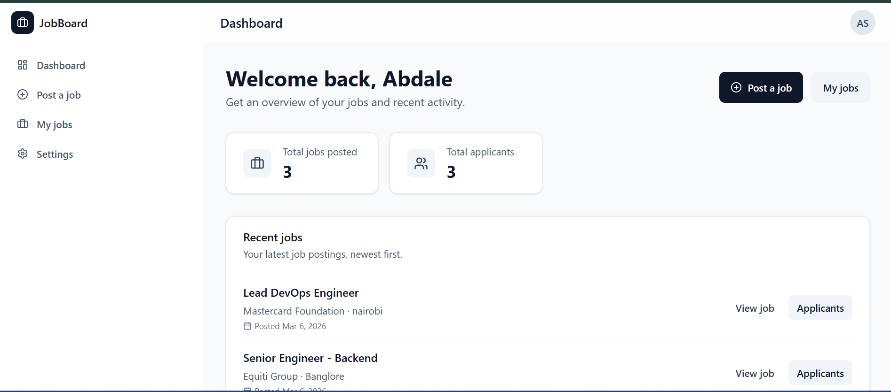

# Job Board

A modern job board platform where employers can post jobs and manage applicants, while job seekers can browse jobs and apply in real time.

Built with **React, Vite, TailwindCSS, and Supabase**.



## Tech Stack

React • Vite • TailwindCSS • Supabase • Vercel

## Features

- Employer job management  
- Job seeker applications  
- Role-based dashboards  
- Real-time updates  
- Responsive UI  

live Demo:https://job-board-snowy-six.vercel.app/login
## Run Locally

```bash
git clone https://github.com/abdsaed012/job-board.git
cd job-board
npm install
npm run dev